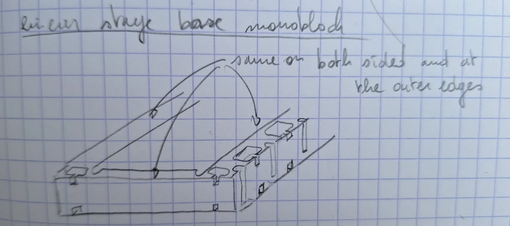

# 2026-09-23 — Linear stage base redrawn as one aluminium block

**Role(s):** engineering, cad

## What happened

The base of the linear axis is now drawn as one solid aluminium block (a
monoblock). The base is 3.5 mm lower than before. The steel strip seal and its
rollers moved with it. The work was done by hand in `cad/architecture/machine.FCStd`, body `Linear axis`.

Hand sketch of the monoblock base. The features are "same on both sides and at
the outer edges".

### Base cross-section

- The base is now 40 mm high instead of 43.5 mm. It stays 210 mm wide.
- The inner walls stay at 23 mm and 187 mm. They now stop at 39.2 mm high,
  instead of 42.65 mm.
- The lips that hold the seal ends were redrawn with a smaller step.
- The steel strip seal is now 172 mm long instead of 170.5 mm. It lies at
  39.8 mm high and stays 0.1 mm thick.
- New: a reference line across the top at 50 mm high, from 11 mm to 199 mm.
- New: a slot 5 mm deep in the right outer face, between 5 mm and 20 mm high.
- New: the cable exit of the Saho/Maxwell linear motor mover, 6.8 mm across.
  It sits at 144.6 mm from the left face and 32.55 mm high.
- The plate and the chamfered block on the left inner wall did not change.

### Seal rollers

- The two inner rollers are now 10 mm across, instead of 9.8 mm.
- They moved 13 mm further out each. Their centres are now at 47.7 mm and
  170.7 mm, instead of 60.7 mm and 157.7 mm.
- They moved 5.1 mm down, to 45 mm high. The highest point of the strip path is
  now 50 mm, instead of 55 mm. The strip lifts less over the carriage.
- The two outer rollers did not change.

The machine footprint, enclosure, boundary, top view and both rotary-axis bodies
were not touched.

## Open Questions

- The sketch shows slots on both outer faces. The model has the outer slot on
  the right side only. Confirm that it should be mirrored to the left side.

## Next Steps

- [ ] Mirror the outer slot to the left side.
- [ ] Choose the aluminium stock or the machining supplier for the monoblock,
      and add it to the parts list.
- [ ] Check that the lower base does not change the Z travel or the machine
      boundary.
