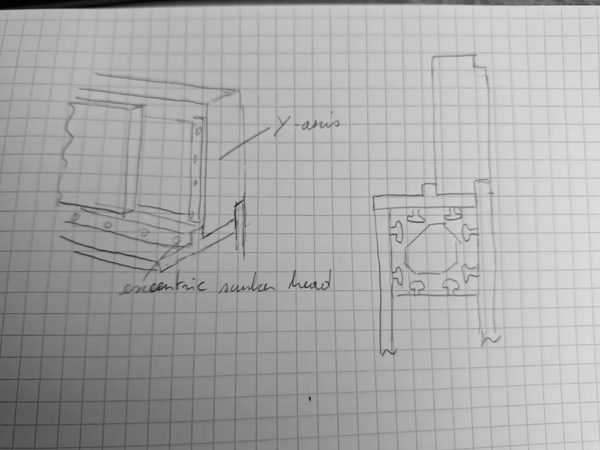

# 2026-09-30 — Idea: a printed clamp with crossed countersunk screws

**Role(s):** engineering, hardware

## What happened

We looked at a way to fix the Y-axis to the frame without screw holes in the
blocks. The idea works in principle, but it is not good enough for the Y-axis
mount. The joint would slowly lose its clamping force, and a printed part is too
flexible in a milling machine.

Hand sketch of the idea. A 3D printed holder guides two crossed countersunk
screws ("crossed sunken head cap screws → mounting Y-axis to frame"). One screw
goes into each block. The second screw has an off-centre countersink seat
("eccentric sunken head"). When you tighten it, it pulls the block down.

### Why the idea can work

- An off-centre countersink seat is a known clamping trick for fixtures. The
  cone of the screw head pushes sideways as it sits down. This turns the turn of
  the screw into a pull between the two parts.
- Two screws at opposite angles hold better against pulling out than one
  straight screw.

### Why it will come loose on Qarve

1. **Plastic carries the clamping force.** All of the force goes through the
   printed holder. Plastic slowly gives way under a constant load (creep). PLA
   does this more than PETG. The screw head sinks a little into its cone seat.
   A few tenths of a millimetre is enough to lose most of the clamping force.
   The cone also pushes outward, so the seat can split along the print layers.
2. **The off-centre seat has very little travel.** It pulls only while the cone
   sits fully on the offset. When the plastic gives way, the pull is lost. If
   you tighten again, the head only sinks deeper.
3. **Vibration.** The Y-axis linear motors (Saho WJM50-3) change direction with
   high acceleration. Each change loads the joint again. A joint that has lost
   some clamping force soon works itself loose.
4. **Stiffness.** Even when it is tight, the printed holder acts like a spring
   between the axis and the frame. This costs stiffness, accuracy and surface
   finish.
5. **Holes are still needed.** The frame is aluminium extrusion. A screw cannot
   hold in bare aluminium without a tapped hole or a nut.

## Decisions

- Do not use a printed crossed-screw clamp to carry the Y-axis load.

## Open Questions

- What is the second block exactly: the linear stage monoblock base or a motor
  housing? Which faces can a tool reach?

## Next Steps

- [ ] Fix the Y-axis base to the 80×80 and 40 mm extrusions with T-slot nuts
      (drop-in or hammer-head, M8). This needs no drilling in the frame.
- [ ] If new holes are needed, use the printed holder only as a drilling jig
      (a guide for the drill and tap). Then remove it and bolt metal to metal.
- [ ] Only for a test model, if a printed clamp must carry load: print in PETG,
      ASA or PC. Use 100% fill and at least 4 mm of wall around each seat. Put a
      metal countersunk washer in each seat. Add disc spring washers (Belleville
      washers) and medium thread-locking glue. Tighten again after 24 hours.
