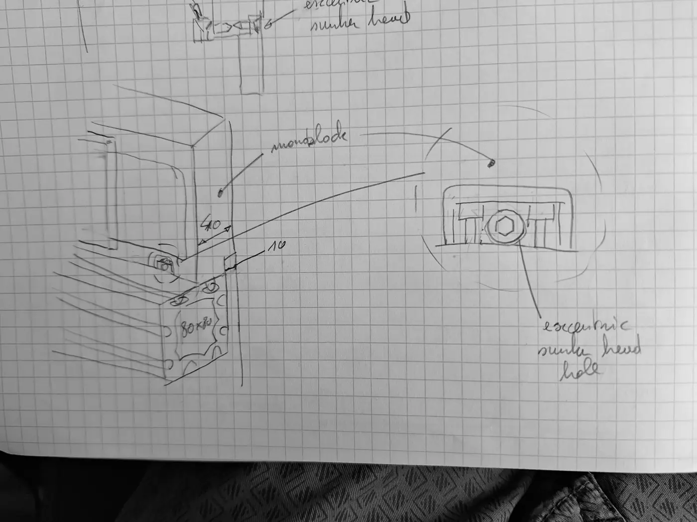

# 2026-09-30 — Y-axis mounted on the frame with eccentric countersunk screws

**Role(s):** engineering, hardware

## What happened

Two hand sketches show a way to fix the Y-axis to the machine frame. The Y-axis
base (the aluminium monoblock) sits on top of an 80 × 80 mm aluminium
T-slot profile. Screws with an eccentric countersunk head hold it down and let
it be adjusted. No CAD model was made yet.

This follows the [printed clamp with crossed countersunk screws](2026-09-30_crossed-countersunk-screw-clamp-idea.md),
logged the same day. That idea was judged not stiff enough. Here the eccentric
countersunk screws go straight through the monoblock into the frame profile.

Sketch 1: the Y-axis on the frame profile (left), and a cross-section through
the joint (right).

Sketch 2: the same corner with dimensions, and a detail of the eccentric
countersunk head hole.

### The idea as sketched

- The frame member is an 80 × 80 mm T-slot profile. The Y-axis monoblock sits
  on its top face.
- A row of screws goes down through the monoblock into the T-slots of the
  profile. Each screw has an eccentric countersunk head, set in a matching
  countersunk hole.
- Turning an eccentric head moves the monoblock sideways a little before the
  screw is tightened. This gives a fine position adjustment, for example to
  make the two Y-axes parallel.
- The cross-section shows a small key on the frame side that fits into a step
  in the monoblock, and a lip on the outer side that hangs down along the
  profile. Both locate the axis on the frame.
- Dimensions written on the sketch: **10 mm** for the lip, and **10 mm**
  between the edge of the monoblock and the screw line (read as 10 mm, could
  also be 40 mm).

## Open Questions

- Is the second dimension 10 mm or 40 mm?
- Is the lip part of the monoblock, or a separate plate between the monoblock
  and the profile?
- Which eccentric countersunk screw or bushing (size, eccentricity, supplier)?
  How much adjustment is needed?
- Does the eccentric adjustment also need a lock, so the axis does not move
  under cutting load?

## Next Steps

- [ ] Confirm the dimensions and the lip design.
- [ ] Choose the eccentric countersunk screw and find a supplier.
- [ ] Model the joint in `cad/architecture/machine.FCStd`, and add the 80 × 80
      profile and the screws to the parts list.
- [ ] If this becomes the chosen joint, record it in `docs/decisions/`.
